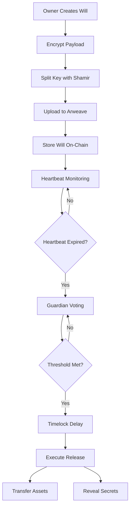

# 💀⚡ Dead Man's DAO - Decentralized Digital Inheritance

> **Your legacy, secured on the blockchain, immune to corruption, time, or human interference.**

A revolutionary **decentralized, autonomous inheritance & secret transfer system** that lives entirely on-chain. Dead Man's DAO enables you to securely transfer digital assets, private keys, or encrypted messages only after specific conditions are met, using only Solidity smart contracts and cryptographic proofs.

## 🌟 Overview

Dead Man's DAO represents the world's first truly decentralized digital inheritance system that:

- **Lives entirely on-chain** - Pure Solidity, zero trust in humans or companies
- **Unlocks assets autonomously** - Time delays, GPS proofs, blockchain events, death verification
- **Unstoppable execution** - Not even governments, hackers, or creators can alter after deployment  
- **Cryptographically secure** - Uses Shamir's Secret Sharing and threshold signatures
- **Cross-generational** - Designed to survive 100+ years of technological change

## 🏗️ Architecture

### Core Components

1. **WillManager** - Central registry and lifecycle management
2. **AssetVault** - Custodial storage for ETH, ERC20, ERC721, ERC1155
3. **GuardianRegistry** - Guardian management with reputation system
4. **Encryption Client** - Off-chain secret sharing and Arweave storage
5. **Automation Layer** - Chainlink Automation for autonomous execution

### System Flow



## 🚀 Features

### 🛡️ **Autonomous Security**
- **Heartbeat Monitoring** - Regular proof-of-life with customizable intervals
- **Guardian Consensus** - Distributed approval from multiple trusted parties  
- **Timelock Protection** - Configurable delays to prevent premature execution
- **Oracle Integration** - External verification through Chainlink automation

### 🔐 **Advanced Cryptography**
- **AES-256-CBC Encryption** - Military-grade payload protection
- **Shamir Secret Sharing** - Key splitting with configurable thresholds
- **Threshold Signatures** - Future support for GG18/MPC protocols
- **Commitment Schemes** - On-chain proof of off-chain data integrity

### 💎 **Multi-Asset Support**
- **Native ETH** - Direct Ethereum transfers
- **ERC20 Tokens** - Any compatible token
- **ERC721 NFTs** - Unique digital assets
- **ERC1155 Tokens** - Gaming and utility tokens
- **Encrypted Data** - Private keys, documents, messages

### 🌐 **Decentralized Storage**
- **Arweave Integration** - Permanent, censorship-resistant storage
- **IPFS Support** - Distributed file system compatibility  
- **Content Addressing** - Immutable links to encrypted payloads
- **Redundancy** - Multiple storage providers for reliability

## 📋 Prerequisites

- **Node.js** v16+ and npm
- **Hardhat** development environment
- **MetaMask** or compatible wallet
- **Arweave Wallet** for permanent storage
- **Git** for version control

## ⚙️ Installation

1. **Clone the repository**
```bash
git clone https://github.com/your-org/dead-mans-dao.git
cd dead-mans-dao
```

2. **Install dependencies**
```bash
npm install
```

3. **Set up environment**
```bash
cp .env.example .env
# Edit .env with your configuration
```

4. **Compile contracts**
```bash
npm run compile
```

5. **Run tests**
```bash
npm test
```

6. **Deploy to local network**
```bash
npm run node          # In terminal 1
npm run deploy        # In terminal 2
```

## 🧪 Testing

### Contract Tests
```bash
npm test                    # Run all tests
npm run test:coverage      # Coverage report
npm run test:gas           # Gas usage analysis
```

### Integration Tests
```bash
npm run test:integration   # Full system tests
npm run test:e2e          # End-to-end scenarios
```

### Security Testing
```bash
npm run security          # Static analysis with Slither
npm run fuzz             # Fuzzing tests
```

## 🚀 Deployment

### Local Development
```bash
npm run node             # Start local Hardhat network
npm run deploy:local     # Deploy to local network
npm run frontend:start   # Start React frontend
```

### Testnet Deployment
```bash
npm run deploy:sepolia   # Deploy to Sepolia testnet
npm run verify:sepolia   # Verify contracts on Etherscan
```

### Mainnet Deployment
```bash
npm run deploy:mainnet   # Deploy to Ethereum mainnet
npm run verify:mainnet   # Verify contracts
```

## 📖 Usage Guide

### Creating a Will

1. **Connect Wallet** - MetaMask or WalletConnect
2. **Prepare Payload** - Encrypt sensitive data
3. **Select Guardians** - Choose trusted parties
4. **Set Conditions** - Heartbeat interval, thresholds
5. **Fund Vault** - Deposit assets (optional)
6. **Deploy Will** - Submit to blockchain

### Example: Basic Will Creation

```javascript
const DeadManCrypto = require('./client/encryption');
const crypto = new DeadManCrypto();

// 1. Encrypt your secrets
const payload = "My Bitcoin wallet seed: abandon abandon abandon...";
const willPackage = await crypto.createWillPackage(
    payload,
    ['0x123...', '0x456...', '0x789...'], // Guardian addresses
    2, // Threshold: 2 of 3 guardians needed
    arweaveWallet
);

// 2. Create will on-chain
const tx = await willManager.createWill(
    willPackage.guardianShares.map(g => g.guardianAddress),
    willPackage.threshold,
    willPackage.encryptedCID,
    willPackage.payloadHash,
    30 * 24 * 60 * 60, // 30 day heartbeat timeout
    ['0xBeneficiary1...', '0xBeneficiary2...'],
    vaultAddress
);
```

### Guardian Operations

```javascript
// Register as guardian
await guardianRegistry.registerGuardian(
    "ipfs://your-guardian-metadata",
    ethers.utils.keccak256(ethers.utils.toUtf8Bytes("your-public-key")),
    ethers.utils.keccak256(ethers.utils.toUtf8Bytes("commitment-root"))
);

// Approve will release
await willManager.guardianApprove(willId);
```

### Asset Management

```javascript
// Deposit ETH
await assetVault.depositEth(willId, { value: ethers.utils.parseEther("1.0") });

// Deposit ERC20
await token.approve(assetVault.address, amount);
await assetVault.depositERC20(willId, token.address, amount);

// Deposit NFT
await nft.approve(assetVault.address, tokenId);
await assetVault.depositERC721(willId, nft.address, tokenId);
```

## 🔧 Configuration

### Environment Variables

```bash
# Network Configuration
SEPOLIA_URL=https://sepolia.infura.io/v3/YOUR_KEY
ARBITRUM_URL=https://arbitrum-mainnet.infura.io/v3/YOUR_KEY
PRIVATE_KEY=your_private_key_here

# Services
ETHERSCAN_API_KEY=your_etherscan_key
ARWEAVE_WALLET_PATH=./arweave-wallet.json
CHAINLINK_VRF_SUBSCRIPTION_ID=123

# Security
ADMIN_MULTISIG=0x123...
GUARDIAN_MIN_REPUTATION=100
TIMELOCK_DELAY=604800
```

### Contract Parameters

```solidity
// WillManager Configuration
uint256 public constant MAX_GUARDIANS = 20;
uint256 public constant MAX_BENEFICIARIES = 50;
uint64 public constant MIN_HEARTBEAT_TIMEOUT = 1 days;
uint64 public constant MAX_HEARTBEAT_TIMEOUT = 10 * 365 days;
uint64 public constant RELEASE_TIMELOCK = 7 days;

// Guardian Registry Configuration
uint256 public minReputation = 100;
uint256 public maxWillsPerGuardian = 100;
```

## 🛡️ Security Considerations

### Smart Contract Security
- **Audited Libraries** - OpenZeppelin contracts only
- **Reentrancy Guards** - All external calls protected
- **Access Controls** - Role-based permissions
- **Emergency Pauses** - Admin-controlled circuit breakers
- **Upgrade Paths** - Governed migration mechanisms

### Cryptographic Security
- **Key Management** - Never store raw keys on-chain
- **Share Verification** - Cryptographic commitments
- **Secure Channels** - Encrypted guardian communication
- **Forward Secrecy** - Ephemeral reconstruction keys

### Operational Security
- **Multi-sig Admin** - Distributed administrative control
- **Timelock Governance** - Delayed critical operations
- **Oracle Redundancy** - Multiple data sources
- **Guardian Diversity** - Geographic and institutional spread

## 🤝 Contributing

We welcome contributions from developers, security researchers, and domain experts!

### Development Setup
1. Fork the repository
2. Create feature branch (`git checkout -b feature/amazing-feature`)
3. Install dependencies (`npm install`)
4. Make changes and add tests
5. Run test suite (`npm test`)
6. Commit changes (`git commit -m 'Add amazing feature'`)
7. Push to branch (`git push origin feature/amazing-feature`)
8. Open Pull Request

### Areas for Contribution
- **Smart Contract Development** - Core protocol features
- **Frontend Development** - User interface improvements
- **Security Research** - Vulnerability assessment
- **Documentation** - Guides and tutorials
- **Integration** - Third-party wallet support

## 📚 Documentation

- **[Technical Specification](./docs/technical-spec.md)** - Detailed protocol design
- **[API Reference](./docs/api-reference.md)** - Contract interfaces
- **[Security Audit](./docs/security-audit.md)** - Third-party assessment
- **[User Guide](./docs/user-guide.md)** - Step-by-step tutorials
- **[Guardian Manual](./docs/guardian-manual.md)** - Guardian responsibilities

## 🗺️ Roadmap

### Phase 1: Core Protocol ✅
- [x] Smart contract development
- [x] Basic encryption utilities
- [x] Guardian registry system
- [x] Asset vault implementation

### Phase 2: Integration 🚧
- [ ] Chainlink Automation integration
- [ ] Arweave storage implementation
- [ ] Frontend interface
- [ ] Testing and audits

### Phase 3: Advanced Features 📋
- [ ] Threshold signature schemes (GG18)
- [ ] Cross-chain asset support
- [ ] Mobile applications
- [ ] Enterprise integrations

### Phase 4: Ecosystem 🌐
- [ ] Third-party guardian services
- [ ] Legal framework integrations
- [ ] Insurance products
- [ ] Decentralized governance

## 📄 License

This project is licensed under the MIT License - see the [LICENSE](LICENSE) file for details.

## ⚠️ Legal Disclaimer

**IMPORTANT**: Dead Man's DAO is experimental software that replaces traditional legal processes with smart contracts. This may not be legally binding in all jurisdictions. Users should:

- Consult legal professionals in their jurisdiction
- Understand local inheritance and estate laws
- Consider hybrid legal + blockchain approaches
- Be aware of data permanence implications
- Test thoroughly with small amounts first

The creators assume no responsibility for legal compliance, asset loss, or jurisdictional conflicts.

## 🆘 Support

- **Discord** - [Join our community](https://discord.gg/deadmansdao)
- **Telegram** - [Technical discussions](https://t.me/deadmansdao)
- **Email** - support@deadmansdao.org
- **GitHub Issues** - Bug reports and feature requests

## 🙏 Acknowledgments

- **OpenZeppelin** - Secure smart contract frameworks
- **Chainlink** - Decentralized oracle infrastructure  
- **Arweave** - Permanent data storage protocol
- **Ethereum Foundation** - Blockchain infrastructure
- **Hardhat** - Development environment

---

**Dead Man's DAO** - Where mathematics meets mortality, and code conquers time.

*"The future belongs to those who prepare for it, even beyond their own existence."*